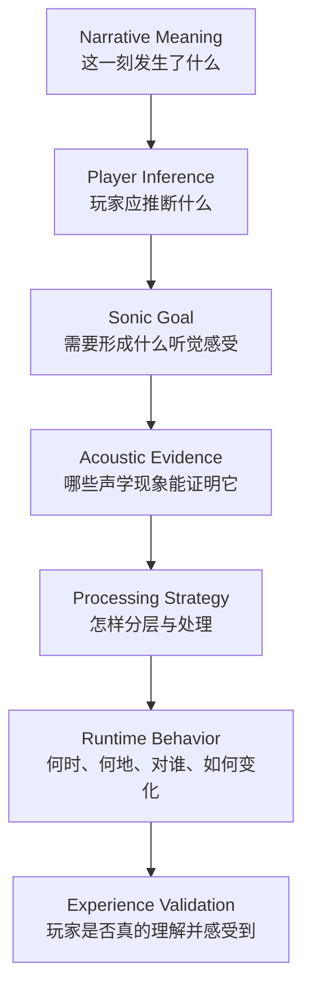
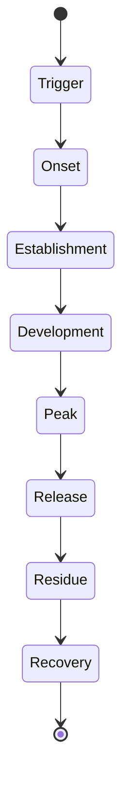
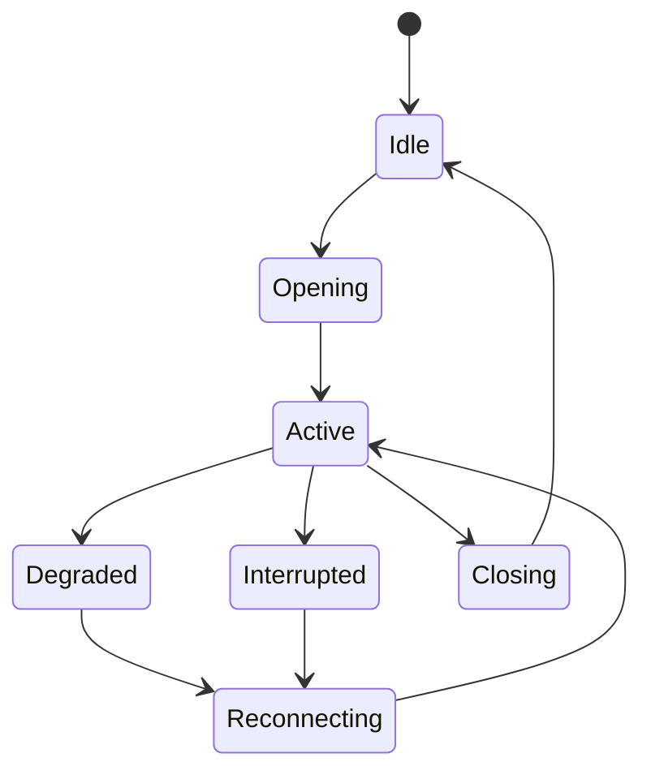

## 从角色、对白与叙事机制，到 Processing Chain和空间传播 
> 本文讨论的不是“怎样把人声做得更酷”，而是：语音设计师如何先判断一段声音在人物、叙事、世界与玩法中究竟意味着什么，再把这种意义转译成表演、声学行为、效果链、空间关系和运行时规则。

---

## 摘要

游戏中的 Voice Over 不是一批录音文件，也不是演员原声经过若干插件之后的结果。它是一套让角色、叙事信息和世界规则通过声音进入玩家感知的系统。演员决定角色以怎样的意图和身体状态说话；声音处理决定这个身体是否仍是人类、是否承载其他意识、是否经过装置、是否受到某种力量改变；Emitter、Channel 与 Spatialization 决定声音从哪里出现、通过什么媒介传播、谁能够听见；运行时逻辑则决定它何时发生、怎样变化、是否被打断以及如何与游戏中的其他信息竞争。

因此，语音设计不能从“我想用什么插件”开始，而应遵循下面的因果链：



这条链路包含两个必须同时闭合的回路：

- **叙事闭环**：每个声音选择都能解释它在故事中代表什么。
- **体验闭环**：这些选择进入真实游戏后，仍然可懂、可辨、可定位，并能在正确时机影响玩家。

Mark Mangini 对《沙丘》The Voice 的设计说明了第一个回路：先重新定义能力的力量来源，再设计祖先声、空间、低频、时间错位和环境退让。Austin Mullen 对大量 Riot 角色 VO 的拆解说明了第二个回路：把角色幻想拆成不同功能层，并通过频谱分工、动态避让、串并联结构和保留演员核心，使复杂处理在游戏混音中仍然成立。《Varsapura》的语音则进一步提醒我们：角色音色只是起点，同一句话经过现场空气、无线电、PA、车载设备、系统界面、内心意识或异常精神通路，会成为完全不同的叙事事件。

---

# 第一章：语音设计真正设计的是什么

## 1.1 Processing Chain 是结果，不是起点

Pitch Shift、Formant、Distortion、Reverb、Delay、Layering、Modulation 都只是改变信号的工具。它们本身不包含稳定的叙事意义：Delay 既可以表示科技设备，也可以表示精神分裂、空间反射、记忆残留或未来预回声；Chorus 既可能代表集体意识，也可能只是增加宽度；低频既可能代表庞大身体，也可能代表权威、压力或玩家身体层面的冲击。

如果从插件开始，设计过程往往变成：

```text
尝试插件 → 得到有趣音色 → 再为音色寻找理由 → 继续叠加 → 可懂度下降
```

声音设计应当反过来：

```text
定义事件 → 明确推断 → 寻找声学证据 → 选择处理方法 → 管理副作用 → 进入运行时验证
```

真正被设计的不是一条“滤镜后的人声”，而是玩家对声音的理解。例如玩家听见一个角色时，需要在很短时间内判断：谁在说、从哪里说、是否对我说、是否可信、是否紧急、是否仍是同一个人、是否受到其他力量影响，以及我现在是否必须采取行动。语音设计师实际是在安排这些判断的证据。

## 1.2 一段 VO 同时包含七个设计对象

| 维度 | 核心问题 | 主要设计手段 |
|---|---|---|
| 角色 | 谁在说？他的身体、身份和情绪是什么？ | 选角、表演、音区、节奏、Voice ID |
| 叙事 | 为什么现在说？这句话改变了什么？ | 台词、潜台词、叙事视角、信息顺序、母题 |
| 机制 | 声音由什么力量或过程产生？ | 分层、素材身份、时间关系、调制逻辑 |
| 媒介 | 通过空气、电话、广播、AI还是精神通路？ | 频宽、失真、编码、设备 IR、噪声、传输状态 |
| 空间 | 最终从哪里抵达听者？ | Emitter、距离、朝向、遮挡、混响、空间宽度 |
| 玩法 | 谁能听、何时触发、怎样变化？ | Trigger、Audience、Priority、State、RTPC |
| 混音 | 此刻它应当占据多少注意力？ | 响度、频谱让位、Duck、字幕、打断与恢复 |

最终声音可以概括为：

```text
Final Voice
= Character Identity
× Narrative Situation
× Source / Medium
× Playback Endpoint
× Spatial Rule
× Audience / Access
× Time / State
× Information Priority
```

这里使用乘法，是因为任一维度改变，都可能使整段声音的性质发生变化。远程 Sayuki 仍然是 Sayuki，但她不再通过现场身体发声；DAWN 保持同一套系统身份，却可以从 HUD、车载扬声器或培训录像中出现；一句内心判断即使与现场台词文字相同，也不应机械地沿用现场 3D 声源规则。

## 1.3 先问 Why，不代表只谈抽象概念

“先问 Why”不是延迟制作，也不是用世界观替代技术判断，而是用意义压缩搜索空间。假如命题只是“做一个诡异声音”，几乎所有效果器都有可能；假如命题变成“一个仍保留人性、但正在与体内恶魔力量拉扯的角色”，选择便受到约束：演员情绪必须被保留，非人层不能吞没主体，两个状态必须共享身份骨架，而变化应体现控制权的改变。

一个可执行的 Why 至少需要回答：

1. 这一声音事件为什么存在？
2. 它要让玩家知道、感到或做什么？
3. 力量来自谁或什么机制？
4. 有哪些主体共同参与？
5. 哪些现实规则在此刻保持，哪些被改变？
6. 这种变化怎样随剧情、能力或玩法状态发展？

只有回答到这个程度，Why 才能继续推导选角、效果、空间和运行时参数。

## 1.4 判断设计是否成立的标准

一条复杂效果链并不因为插件多、参数精细就成立。更有效的判断标准是：

- **可归因**：每一层为什么存在，能否用一句叙事或功能语言解释？
- **可识别**：离开画面后，玩家是否仍能认出角色、媒介或能力？
- **可理解**：重要信息能否在真实战斗和设备上被听清？
- **可变化**：声音是否能表达状态、距离、掌握程度和剧情发展？
- **可实现**：线性样片中的效果能否转换为游戏状态和资源结构？
- **可协作**：导演、剪辑、叙事、动画和程序能否独立控制重要层？
- **可克制**：去掉某层后，如果意义不变，这一层是否真的必要？

Mangini 所强调的减法思维在这里尤其重要。强大不一定来自把声音做得更满；《沙丘》The Voice 的压迫感，一部分恰恰来自正常环境被抽走。当世界退让，权力关系才被听见。

---

# 第二章：先定义角色，再设计声音身份

## 2.1 角色设计解决“无论在什么场景，他仍是谁”

在开始处理前，应先回答五个问题：

- 这个角色是谁？他的物种、身体、年龄、阶层、文化和行动方式是什么？
- 玩家应该从他身上感受到什么角色幻想？
- 他的语音长期承担什么信息职责？
- 他与阵容中其他角色有什么可听见的差异？
- 皮肤、能力、受伤、变身和剧情阶段会改变什么，又必须保留什么？

这些答案共同定义 Voice Identity。它不是一个固定 preset，而是一组“稳定项 + 可变量”。

| 稳定项 | 可变量 |
|---|---|
| 基本人格、语言节奏、重音习惯 | 情绪强度、疲劳、疼痛、战斗压力 |
| 核心音区与身体感 | 姿态、距离、喊叫与耳语 |
| 标志性的质感或频谱轮廓 | 皮肤材质、设备、能力状态 |
| 角色与玩家的关系 | 剧情阶段、控制权、腐化程度 |
| 最低限度的演员可辨识度 | 非人层、空间层和运行时处理量 |

因此设计决策的正确顺序是：

```text
Character Proposition
→ Performer
→ Performance
→ Stable Voice ID
→ Variable Texture
→ Processing Architecture
→ Runtime State
```

## 2.2 Performer 与 Performance 是效果链的输入条件

角色声音首先来自演员。表演中的音高、共鸣位置、气息、声门状态、咬字、速度、攻击性和克制程度，会直接决定处理链的输入。强烈失真会把气息和齿音放大；Pitch Tracking 依赖稳定的基频；Reverse Delay 对辅音和停顿极为敏感；过度压缩会改变表演的微动态。换言之，效果器不是覆盖在表演上的独立装饰，而是在读取并放大表演中的某些行为。

表演指导至少需要描述：

| 维度 | 需要确定的内容 |
|---|---|
| 意图 | 他想让对方做什么，而不是“听起来要多凶” |
| 潜台词 | 说出的文本与真实目的之间有什么距离 |
| 身体 | 姿态、伤势、呼吸、体型和发力位置 |
| 关系 | 对自己人、敌人、陌生人、机构和玩家怎样不同 |
| 情境 | 现场距离、噪声、行动强度、是否通过设备 |
| 连续性 | 前后场景的情绪和身体状态如何衔接 |
| 可处理性 | 哪些辅音、尾音、气息或持续元音会驱动后期效果 |

优秀的 VO Processing 往往从“保留演员做对的东西”开始。Austin Mullen 在 Zaahen 的设计中保留了近似干声的可懂度和人性，因为角色的关键不是纯粹恶魔化，而是两个自我之间的冲突。如果把演员的情感完全淹没，角色的核心矛盾也会一起消失。

## 2.3 角色辨识度不是一个滤镜，而是一套有限语法

辨识度来自多个重复但不过度僵化的线索：

- 演员与表演节奏提供“这个人是谁”；
- 核心频谱和质感提供“他的身体是什么”；
- 标志层提供“他具有何种力量或异常”；
- 空间和媒介提供“他此刻怎样抵达我”；
- 运行时变化提供“他现在处于什么状态”。

如果所有角色都使用同样的低八度、宽 Chorus、大 Reverb 和 Distortion，他们不会变得更有辨识度，只会共享一种“游戏特殊人声”的套话。设计师需要建立有限调色板：每个角色选择少量最有解释力的变量，同时规定哪些常见处理不能使用，从而避免与阵容中的其他角色混淆。

可以用一张 Voice Proposition Card 约束方向：

```text
角色核心：
玩家幻想：
长期信息职责：
三个听觉关键词：
必须保留：
允许变化：
禁止滑向：
与相邻角色的差异：
核心处理层：
状态变化轴：
```

“禁止滑向”十分重要。Bel'Veth 的非人感来自吞噬记忆、蜂群意识和伪装成人类的结构，而不是泛化的“恶魔低音”；Zaahen 即使属于 Darkin，也不能处理得与更彻底异化的同族一样；Inkshadow Yone 的气泡、墨影和怪物层需要服务系列与角色，不能无意间变成另一套 Void 语言。

## 2.4 皮肤、能力与变身：改变表层，还是改变本体

状态设计应先判断变化发生在哪一层：

- **服装或皮肤材质改变**：角色人格和表演核心不变，Material/Body 层改变。
- **通讯媒介改变**：角色核心不变，Channel 与 Emitter 改变。
- **能力启动**：增加力量、光环、时间或环境反应层。
- **身体变形**：共鸣、重量、发声器官和动态范围改变。
- **人格夺权或附身**：主体数量、主从关系、同步和空间所有权改变。
- **剧情成长**：控制程度、稳定性和层间融合方式改变。

Austin 对 Sahn Uzal / Mordekaiser 的处理提供了一个重要原则：人类、力量启动与完整铠甲状态虽然逐步增加重量和金属覆盖，但需要共享核心身份，变化才会被理解为“同一角色的演化”，而不是三个互不相关的滤镜。状态之间最好共享一部分演员核心、节奏或标志性频谱，再让附加层逐渐进入、扩大或同步。

---

# 第三章：先定义叙事声音事件，再决定它怎样被听见

## 3.1 角色身份与叙事情境是两套不同问题

“谁在说”不能替代“这一次发声是什么”。同一个角色可能现场交谈、通过无线电下令、在回忆中出现、成为主角的幻觉、留下档案录音，或以未来回声的方式提前进入。角色 Voice ID 负责连续性；叙事声音设计负责这次声音与现实、时间、视角、听众和剧情的关系。

一段叙事声音至少需要沿八个坐标判断：

| 坐标 | 需要回答的问题 |
|---|---|
| 戏剧功能 | 推进事件、塑造关系、揭示人物、建立世界、误导、预示还是要求玩家行动？ |
| 声音主体 | 现场人物、旁白者、内在自我、他者意识、集体、机构、AI还是环境？ |
| 现实层级 | 客观现场、主观感知、梦境、幻觉、精神空间还是纯叙事层？ |
| 时间来源 | 当下、实时远程、录制过去、记忆重构、循环、未来或时间异常？ |
| 可靠性 | 客观、片面、不可靠、伪造、污染还是暂不可判断？ |
| 听觉视点 | 从镜头、玩家角色、说话者、接收者还是全知叙事位置听？ |
| 可听权限 | 所有人、附近人、小队、指定对象、角色本人还是仅现实玩家？ |
| 与画面关系 | 画内、画外、先声后人、先人后声、反位、跨场景或覆盖蒙太奇？ |

这套坐标比简单标记“Diegetic / Nondiegetic”更有用。例如：

```text
Simmons
= Off-screen / Live / Remote / Radio-mediated
/ Team-private / Objective Diegetic Voice

Mindbog Thought
= Off-screen / Non-localized / Intrusive / Selective
/ Subjective-anomalous Diegetic Voice
```

## 3.2 叙事声音的主要类型

### 现场与画外叙事

现场对白不只是“普通干声”。它需要表现人物之间的距离、朝向、遮挡、社会关系与场面调度。画外声则可以制造预期、危险、空间延伸或信息延迟。“看不见”并不等于声音属于故事外：暂时离开镜头的队友、隔墙呼喊、先闻其声后见其人的角色，都仍可能是 Local Diegetic。

### 旁白与叙事者

旁白需要先判断叙述者是谁：全知作者、未来的角色、正在回忆的角色、档案记录者，还是包装成系统提示的世界内 AI。不同身份决定声音是否拥有身体、是否受空间影响、是否可靠，以及它与画面是解释、反讽还是对位关系。中置、近耳、无环境声只是常见表现，不是旁白的定义。

### 内心独白与内在对话

内心独白是角色自己的当前思考，通常强调亲密、可懂度和自我所有权；内在对话则可能包含自我质询、不同人格或内化的他人。它们的区别不是是否使用 Reverb，而是谁拥有这句话、角色能否控制它、其他角色能否听见。若内心声过度像外部幽灵，玩家会误判声源；若附身声处理得像普通独白，控制权冲突又会消失。

### 记忆、闪回与档案

档案录音是世界中真实存在的媒介对象；记忆是角色对过去的重构。两者即使播放相同一句话，设计逻辑也不同。档案需要设备、年代、载体与播放位置；记忆需要触发线索、主观选择、事实缺口和可靠性。记忆不必一律做成窄频、Lo-fi 和大混响；更有意义的是设计它“保留了什么、删掉了什么、怎样被现在的情绪改写”。

### 梦境、幻觉与错误知觉

梦境可以拥有自身完整的世界内声学；幻觉则是现实场景中出现了不存在的声源；错误知觉可能只是角色把真实声音误认成另一个东西。三者需要不同规则。梦境可以连续但遵循另一套空间逻辑，幻觉需要与现实争夺可信度，错误知觉则可以先呈现主观版本，再通过视角切换揭露客观版本。

### 预言、未来回声与时间异常

未来声音不只是“神秘 Reverse Reverb”。它应与尚未发生的事件、概率分支和角色行动相连。确定性越高的未来可以越清晰；已经失效的未来应衰减或断裂；声音可从未来事件将发生的方向提前抵达。时间处理只有与叙事状态对应，才真正表达未来。

### 精神通讯、侵入、附身与集体意识

精神通讯是双方有意建立的通路；精神侵入是外来内容突破角色边界；附身是外部主体争夺身体控制权；集体意识则可能是多个主体形成共同意志。它们都可能使用叠层、Reverse Delay 或宽立体声，但声学关系不同：通讯强调连接，侵入强调边界被破坏，附身强调主从争夺，集体意识强调多节点共识或共同来源。

### 制度、系统与设备叙事

公共广播、调度中心、AI 助手、培训模块和安全展品不仅承担信息，也塑造机构。用词规范、播报节奏、优先级、提示音、频响和覆盖范围共同说明：谁拥有发言权、系统是否可靠、城市如何管理人，以及玩家在制度中处于什么位置。

## 3.3 声音处理也可以发生在“人声之外”

一个常见误区是：既然设计对象是 VO，所有意义都必须通过处理人声实现。实际上，叙事声音事件至少有五类可操作对象：

| 对象 | 可以表达的意义 |
|---|---|
| 人声本体 | 身体、年龄、物种、情绪、人格和发声机制 |
| 伴随层 | 祖先、群体、机器、怪物、记忆碎片或能量 |
| 空间 | 所有权、距离、主客观视点、身体内外和权力范围 |
| 环境与其他系统 | 世界是否接受、抵抗或被声音压制 |
| 时间与剪辑 | 控制程度、认知连续性、预示、回忆和因果顺序 |

《沙丘》The Voice 的突破点正是“答案在 Voice 之外”：祖先的历史由额外演员层体现，力量超出身体由环绕空间体现，命令对现实的统治由低频冲击和环境退让体现，Paul 尚未掌握能力则由各层时间错位体现。若只在 Paul 的主声轨上继续失真和变调，这些叙事关系都无法出现。

## 3.4 从叙事意义到声学证据

下面的表格不应被当作 preset，而是推理示范：

| 叙事情境 | 玩家应产生的推断 | 优先设计的关系 | 可能的声学证据 |
|---|---|---|---|
| 不是完全人类 | 人形外表下存在异质结构 | 人类核心与异质层共存 | 轻微 Formant 偏移、非谐波层、随机运动，同时保留清晰主声 |
| 多个意识共存 | 一句话包含多个主体 | 个体与群体、同步与差异 | 多演员或多表演层、微时差、声像分布、关键词聚合 |
| 被附身或人格侵入 | 另一个主体正在夺取控制 | 主体与侵入层动态争夺 | Reverse 预进入、叠层、门控渗漏、主从响度和空间权变化 |
| 身体由金属构成 | 声音经过实体外壳或机械共鸣 | 喉部声源与身体材料耦合 | Resonator、Cabinet、短反射、限制频响，而非只加长 Delay |
| 精神不稳定 | 认知或控制无法保持连续 | 时间、重复与调制失稳 | 多抽头延迟、随机 LFO、丢帧、颗粒断裂；核心信息仍需锚定 |
| 掌握精神控制 | 声音能够压制接收者与现实 | 发声者、被控制者和环境关系改变 | 祖先层、低频身体冲击、环境 Duck、空间包围和注意力垄断 |
| 亲密告白 | 角色允许听者进入私人距离 | 社会距离突然缩短 | 近讲、低动态、保留呼吸与口腔细节、降低环境竞争 |
| 不可靠回忆 | 角色确信，但事实正在被现在改写 | 过去素材与当前心理相互污染 | 内容缺口、重复版本差异、视角切换、环境细节选择性消失 |
| 死者通过旧录音出现 | 人已缺席，但媒介仍保存其痕迹 | 原人物与物理载体分离 | 角色原声身份 + 年代/设备/损耗 + 真实播放 Emitter |
| 未来回声 | 尚未发生的结果正在反向影响现在 | 未来事件与当前行动建立时间联系 | 预回声、逆向包络、概率驱动清晰度、方向与未来位置关联 |
| 系统发布警报 | 机构拥有区域性的行动权威 | 信息优先级高于自然对话 | 固定播报语法、Chime、压缩、区域 Emitter、可控环境避让 |
| 角色产生解离 | 身体仍在现场，主观意识却与身体脱开 | 客观现场与主观听点分离 | 主声与身体位置解耦、近耳自声、环境远离或低通，不必强失真 |

## 3.5 “因为—所以—但是—因此”：把直觉变成可评审推断

每一个处理选择都可以写成四句：

```text
因为：这个声音在故事中代表什么机制；
所以：需要形成哪种可听见的证据；
但是：该处理会损害什么信息或制造什么误读；
因此：用另一层、动态关系或空间规则进行补偿和整合。
```

例如 Bel'Veth：

```text
因为她不是单一个体，而由吞噬的生命与记忆构成；
所以需要许多微小声音、随机音高与移动滤波产生复数意识；
但是这些处理会遮蔽辅音，并让声音过宽、脱离角色身体；
因此保留清晰主层，用动态 EQ/侧链让主题层避让，并收窄关键频段以重新锚定 Emitter。
```

例如金属身体：

```text
因为发声源位于金属容器或铠甲内部；
所以需要表现腔体共振、反射和材料频响；
但是强 Resonator 与 Cabinet 会产生刺耳峰值并降低可懂度；
因此将材料层并联、限制其频段，用干净核心补辅音，并让共振随音高或能量适量变化。
```

这种表达方式能让叙事、音频和程序共同评审。讨论不再停留在“更酷一点”或“再怪一点”，而会变成：玩家是否需要把它理解为金属身体，当前证据是否足够，以及哪项副作用正在阻止理解。

## 3.6 特殊叙事声音还需要完整生命周期

精神侵入、回忆、幻觉和能力声不能只设计一个稳定 Loop。它们应当具有事件曲线：



- **Trigger**：地点、物件、压力、能力、台词或剧情状态触发。
- **Onset**：让玩家察觉边界开始改变，常由预回声、静音、呼吸或空间偏移承担。
- **Establishment**：明确是谁或什么进入，以及它与现实的关系。
- **Development**：层数、失真、空间和控制权随事件推进变化。
- **Peak**：意义、强度和玩家行动要求达到最高点。
- **Release**：主体退出或能力停止，不能简单硬切。
- **Residue**：尾声、记忆、耳鸣、环境恢复延迟等留下后果。
- **Recovery**：听觉视点与正常世界重新对齐。

这使“特殊效果”从一个音色变成具有叙事起承转合的声音事件。

---

# 第四章：Processing Chain 如何构成声音

## 4.1 按功能组织轨道，而不是按插件家族组织

Austin Mullen 的案例最有价值之处，不是公开了某个插件 preset，而是显示出复杂 VO 通常由功能不同的层协作完成：

| 功能层 | 主要职责 | 可以牺牲什么 | 不应牺牲什么 |
|---|---|---|---|
| Human / Performance Core | 保存演员、人物与情绪 | 特殊感可以较弱 | 身份与表演逻辑 |
| Intelligibility | 保证文字、辅音和行动信息 | 可以很薄、很干 | 关键语义 |
| Character Fantasy | 表现非人、魔法、群体或异常机制 | 不必完全可懂 | 与角色命题的一致性 |
| Weight / Scale | 赋予身体、权威、庞大或冲击 | 高频细节 | 节奏与受控低频 |
| Material / Body | 表现陶瓷、金属、容器、机械结构 | 完整频谱 | 材料特征与响应关系 |
| Aura / Metaphysical Space | 表现超出身体的影响范围 | 精确定位 | 不能遮蔽信息核心 |
| State Layer | 表现变身、受伤、腐化、技能或控制权 | 静态一致性 | 状态可识别和连续性 |
| Glue / Mix Control | 让各层像一个角色，并进入游戏混音 | 独立层的夸张感 | 整体清晰、动态和稳定性 |

某个层单独播放时可以难听、残缺甚至不可理解，只要它在整体中承担明确功能。Zaahen 的低层会主动移除中高频，为正常主声腾出空间；Bel'Veth 的主题层可以不负责文字；PROJECT Senna 的低电平干声只是为复杂效果补回清晰度。评价一个层时，应问它在整体中的职责，而不是要求每层都像完整成品。

## 4.2 四种基本拓扑

### 串联：表现同一声源的连续因果

```text
Actor
→ Pitch/Formant
→ Resonance/Material
→ Distortion
→ Device Filter
→ Dynamics
```

串联意味着前一步生成的结构会成为后一步的输入。例如移动 All-pass 滤波单独听不明显，但进入 Waveshaper 与随机 Pitch Cloud 后，会改变后续失真和分裂的方式。效果顺序因此是在描述“先发生什么、后发生什么”。

### 并联：让多个身份或功能共存

```text
Actor ─┬─ Clean intelligibility
       ├─ Low weight
       ├─ Material body
       ├─ Intruder / ancestors
       └─ Aura
```

并联适合表达一个人物同时拥有多个组成部分。它允许每层拥有不同的频段、动态、空间和状态，也允许运行时单独控制。对于复杂角色，并联通常比在一条轨道上不断叠插件更容易保留演员与可懂度。

### Send / Return：区分身体与外部影响

Reverb、Delay、祖先云或异常空间可以通过 Send 独立存在。这样主声仍锚定身体，而外部影响可以扩散、Duck、自动化或在台词结束后留下 Residue。若把所有空间焊在主声上，就难以在游戏中改变距离、房间或能力强度。

### Multiband：让不同频段承担不同职责

低频可以承担重量，中频承担角色质感，高频承担辅音和接近感。Multiband 不只是修音工具，也是一种“责任分配”。但频段越多并不越高级；只有当不同频段确实需要不同的叙事行为时才值得拆分。

## 4.3 效果之间的六种关系

| 关系 | 含义 | 示例 |
|---|---|---|
| 生成 | 前一效果制造后续处理所需的结构 | Pitch 分层进入 Distortion，产生不同谐波身份 |
| 强化 | 后一效果放大前面已经建立的特征 | Resonator 后接 Waveshaper，强化材料峰值 |
| 纠正 | 修复创意效果的局部技术问题 | 变调后 De-ess、动态 EQ、Transient 控制 |
| 补偿 | 另一层补回被牺牲的功能 | 怪物低层不可懂，由干净核心补回文字 |
| 避让 | 一层根据另一层动态让出空间 | 主题层被主声 Sidechain，主声出现时压低遮蔽频段 |
| 胶合 | 使多个异质层共享共同动态或空间 | 轻总线压缩、共同短空间、有限频谱重叠 |

设计效果链时，不仅要写插件，还要写它们之间是什么关系。两个好听的效果叠在一起可能互相抵消；两个单独不完整的层，通过补偿和避让却可能形成稳定角色。

## 4.4 顺序应当服从虚构因果

一种实用的顺序思维是：

```text
表演与发声器官
→ 身份或主体数量
→ 身体材料与容器
→ 设备或传播媒介
→ 魔法、精神或异常影响
→ 外部空间与环境
→ 混音控制
```

它不是绝对插件顺序，而是因果检查。假如角色先在金属身体中发声，再被无线电传输，那么 Cabinet/Resonance 原则上属于发送端身体，Radio Band-limit 属于传输链，车载扬声器 IR 属于接收端，房间混响属于最终环境。把所有处理堆在一个总线里也许短期听起来接近，但会失去切换接收设备、改变房间或表现网络故障的能力。

## 4.5 三个代表性层架构

### Bel'Veth：可懂主体与吞噬记忆的主题层

```text
Layer 1：压缩主声 → 轻微 Formant 下移 → Vocoder/静态复数声
         → 少量随机 Pitch / All-pass → 可懂度与非人暗示

Layer 2：多路移动滤波 → Waveshaper → 随机 Pitch Cloud
         → Saturation / Convolution → 吞噬记忆与蜂群运动

Shared Aura：异常 Reverb
Mix Control：频谱裁剪、Dynamic EQ / Sidechain、宽度重新收束
```

核心并非“用了 Absynth 或某个 Cloud Filter”，而是两层承担不同责任：第一层必须穿过战斗混音，第二层可以为了主题牺牲文字；随后通过动态避让和空间收束，让异质感仍然属于屏幕中的角色。

### Porcelain Amumu：从陶瓷设定推导身体声学

```text
Clean / Band-limited Core：保留角色和文字
Ceramic Resonance：多组 Resonant Filter + 不同 LFO
Container Body：浴室、罐体或小容器类 IR
Animated Texture：Vibrato / Waveshaper / Aetherizer
Glue：控制尖峰、与主声保持重叠
```

这里的 Convolution 不只是“空间混响”，而是把 IR 当作材料与容器的频谱指纹。多个 LFO 的目的也不是让声音一直晃，而是避免陶瓷共振像固定 EQ 一样机械重复。

### PROJECT Senna：系列语法与游戏可懂度并存

```text
Low-level Dry Core：补回辅音和身份
Processed Core A/B：短高反馈 Delay、Doubler、Stereo Texture
Weight Layer：低频或次谐波重量
Motion Layer：Chorus / Phaser / Stereo Delay
Aura：Ducked Reverb
```

多个处理层并不是单纯“加厚”。它们让 PROJECT 系列的短反馈延迟、宽度与技术质感在复杂游戏混音中仍能存活，而安静的干声保证指令不会被风格吞没。

---

# 第五章：效果器不是意义，而是可组合的声学行为

## 5.1 从“插件名”转向五层描述

具体效果器种类极多，同一类型下面还有不同算法、厂商实现和参数结构。因此，“用了 Delay”“用了 Absynth”“用了 NI 的某个插件”都不足以说明设计。更准确的描述需要分成五层：

```text
Effect Family：Delay / Reverb / Distortion / Modulation
Algorithm：Tape / Digital / Granular / Convolution / All-pass...
Implementation：具体插件或模块
Parameter Behavior：时间、反馈、滤波、随机、跟随、包络
Narrative Role：它在当前链中承担什么意义或功能
```

插件只是某种实现。真正可迁移的知识是：信号发生了什么变化、为什么需要这种变化、它如何响应表演、怎样与其他层交互，以及产生了什么副作用。

## 5.2 Pitch、Formant、Frequency Shifter 与 Ring Modulation

### Pitch Shift

Pitch Shift 按比例移动频率，理想情况下仍保留原来的谐波关系。它适合改变感知音高、尺度、年龄或生成低层、高层和八度层。但大幅下移容易拖慢瞬态、模糊辅音并产生算法颗粒，所以常见做法是让低变调层只承担重量，再由原声或高频层承担文字。

### Formant Shift

Formant 对应声道与共鸣腔体的频谱包络。单独移动 Formant 可以改变感知体型、口腔与物种特征，而不必同步改变基频。轻微下移常被用于“仍像人，但身体结构不完全人类”；过度移动则容易产生卡通化、年龄误读或廉价怪物感。

### Frequency Shifter

Frequency Shifter 对每个频率分量增加或减少固定赫兹数，而不是按比例移动。假设原谐波为 100、200、300 Hz，整体增加 50 Hz 后变成 150、250、350 Hz，它们不再是整数倍，谐波关系被破坏。因此它更适合制造非谐波、失重、金属、外星或认知不稳定的质感。使用量通常要小，或放在主题层而不是可懂核心。

### Ring Modulation

Ring Modulation 用载波与输入相乘，生成和频与差频侧带。它容易产生铃状、机械、非谐波质感。若载波固定，可能很快形成单调的“机器人 cliché”；若载波跟随演员音高、能量或状态变化，它才更像一种活的发声机制。

| 工具 | 保持谐波结构 | 主要感知 | 典型风险 |
|---|---|---|---|
| Pitch Shift | 相对保持 | 音高、尺度、重量 | 辅音模糊、颗粒、速度感改变 |
| Formant Shift | 改变频谱包络 | 声道、体型、物种 | 卡通化、性别或年龄误读 |
| Frequency Shifter | 破坏 | 非谐波、异质、失稳 | 可懂度与音准快速崩坏 |
| Ring Modulation | 生成侧带 | 金属、机械、能量 | 固定音高、刺耳、套路化 |

## 5.3 EQ、Filter、Resonance、All-pass 与 Phase

EQ 不只是修正频响，也可以安排层的职责。高通后的干声可专门提供辅音；低层削去中高频，可避免与演员核心争夺；动态 EQ 可以只在主声出现时压低主题层的遮蔽频段。

滤波器的区别不仅在 Low-pass、High-pass、Band-pass 或 Notch，还包括斜率、共振、相位、驱动方式和调制。固定窄频常表示装置频宽；多个移动共振峰可以表示腔体、虫群、液体或不稳定材料；Envelope Follower 控制的滤波能让质感随表演开合，避免效果与嘴部动作脱节。

All-pass 理论上不直接改变幅度频响，却改变不同频率的相位关系；多个 All-pass 与调制构成 Phaser。相位变化单独听可能轻微，但进入 Waveshaper、并联层或宽立体声后会显著改变后续结果。需要区分：

- **Polarity**：整条波形正负翻转；
- **Phase**：各频率或时间关系的偏移；
- **All-pass**：主要改变相位响应；
- **Phaser**：调制多组相位偏移，形成移动峰谷。

并联低频、Doubler 与宽化链必须检查单声道兼容性，否则设计在耳机中很宽，在扬声器、手机或游戏下混中却可能变薄甚至抵消。

## 5.4 Distortion、Saturation、Amp 与 Cabinet

“失真”不是一种声音，而是一组非线性行为：

| 类型 | 主要行为 | 常见叙事用途 |
|---|---|---|
| Saturation | 温和增加谐波并压缩峰值 | 密度、身体感、年代、胶合 |
| Soft / Hard Clipping | 截断波形，增加高次谐波 | 压迫、破损、过载、攻击性 |
| Waveshaping | 按曲线重新映射幅度 | 非人发声、材料强化、可控异化 |
| Bitcrush | 降低位深 | 数字量化、粗糙、数据损伤 |
| Sample-rate Reduction | 降低时间采样精度 | 失帧、数字折叠、老设备或故障 |
| Multiband Distortion | 不同频段使用不同非线性 | 保留高频文字，同时强化低中频身体 |
| Amp / Preamp | 放大器及其动态、谐波和压缩 | 设备、广播、推动感 |
| Cabinet / Speaker | 扬声器、箱体与腔体响应 | 金属身体、面罩、机器人、播放终端 |

Cabinet Simulation 对“金属身体”的价值不在于它听起来科技，而在于它建立了一个虚构容器：声音似乎先在某个有限尺寸、有限频响的结构中产生，再进入外界。若角色只是通过无线电讲话，Cabinet 可能属于接收器；若角色本身是金属构成，它则属于身体层。相同插件因位置不同而具有不同因果。

## 5.5 Delay 与 Reverse Delay：设计的是时间结构

Delay 的基本逻辑相同：复制信号并在时间上延后。但真正的声音由 Delay Time、Feedback、滤波、扩散、Pitch、声像、失真和反馈回路中的处理决定。

| Delay 类型 | 主要行为 | 适合表达 |
|---|---|---|
| Slap / Short Delay | 单次短反射、增厚 | 小空间、设备、靠近表面、PROJECT 式身份 |
| Multi-tap | 多个不同时间节点 | 多意识、复杂空间、认知重复 |
| Ping-pong / Stereo | 左右交替移动 | 空间不稳定、外部环绕、网络节点 |
| Tape / BBD | 每次反馈逐渐染色和退化 | 记忆损耗、旧设备、有机重复 |
| Digital | 精确、清晰、可长时间保持 | 系统、计算、人工空间 |
| Pitch Delay | 每次重复改变音高 | 演化、坠落、上升、非物理反馈 |
| Reverse Delay | 回声在原词之前或逆向进入 | 预感、侵入、未来回声、边界被穿透 |
| Granular Delay | 重排微小时间颗粒 | 失帧、记忆碎片、人格断裂 |
| Diffusion Delay | 回声逐渐扩散成空间 | 非物理 Aura、模糊身体边界 |

Reverse Delay 并不天然等于“被附身”。若它出现在侵入者开口之前，它可以像某个意识先穿过角色边界；若由未来真实台词生成，它可以表示因果倒流；若只是每句话固定出现，则很快退化为装饰。关键是它与台词、状态和主体进入时刻的关系。

反馈回路值得单独设计：在 Feedback 内加入滤波，会让重复逐渐变暗；加入 Pitch，会让每次重复上升或下坠；加入 Distortion，会让系统越重复越失控；加入 Gate 或随机丢弃，会形成不完整意识。Delay 的“尾巴”不是附带结果，而是一个可以叙事化的时间过程。

## 5.6 Modulation：不是某个插件，而是“目标 × 控制源”

Modulation 应写成两个问题：什么参数被改变？谁在控制它？

| 调制目标 | 听觉结果 |
|---|---|
| Amplitude | Tremolo、脉冲、呼吸、断续 |
| Pitch | Vibrato、不稳定、微声群 |
| Delay Time | Chorus、Flanger、时间弯曲 |
| Phase | Phaser、移动峰谷、非实体运动 |
| Filter / Resonance | 腔体变化、表面活动、语音响应材料 |
| Stereo Position / Width | 主体游移、意识分裂、空间包围 |
| Reverb / Diffusion | 空间呼吸、超自然不稳定 |
| Feedback / Distortion | 能量积累、失控、状态升级 |

| 控制源 | 设计含义 |
|---|---|
| LFO | 周期运动，适合机械或稳定振荡 |
| Random / Sample & Hold | 不可预测、异质、精神不稳定 |
| Envelope Follower | 效果随演员能量与音节开合 |
| Pitch Tracker | 材料或谐波关系跟随说话音高 |
| Sidechain / Keying | 一层根据另一层出现而改变 |
| Step Sequencer | 离散、程序化、节奏化状态 |
| Game Parameter | 由生命值、距离、腐化、网络或剧情驱动 |

Chorus、Flanger 和 Phaser 都具有运动感，但机制不同：Chorus 使用微小延迟与调制形成多个相近表演；Flanger 使用更短延迟与反馈形成梳状结构；Phaser 通过相位网络产生移动峰谷。选择它们不能只凭“都挺宽”，而要看叙事需要的是复数表演、机械扫描还是频谱内部的非实体移动。

一个成熟原则是：**静态音色回答“它听起来是什么”，调制行为回答“它怎样活着”。**

## 5.7 Reverb、Convolution 与 IR

Reverb 至少有两种完全不同的职责：

1. **外部环境空间**：房间、街道、大厅、车辆内部，通常应随 Emitter 和游戏区域变化。
2. **角色或能力 Aura**：不属于当前物理房间的超自然空间，可以烘焙、分层或单独 Send。

常见算法包括 Room、Hall、Chamber、Plate、Spring、Convolution 和 Creative/Modulated Reverb。Convolution 的 IR 不必来自真实房间，也可以来自容器、扬声器、金属板、陶瓷空间或经过设计的频谱响应。因此，Porcelain Amumu 的 IR 更接近“身体材料和容器”，而不是角色站在浴室里。

混响的设计变量包括：Pre-delay、Early Reflection、Decay、Diffusion、Damping、Modulation、Stereo Width、EQ 和 Ducking。对于信息型 VO，Ducked Reverb 很有效：说话时空间层退让，句尾再显现，从而同时保留清晰度和幻想。对于内心独白，不应因为它“在脑内”就自动加大 Reverb；脑内声音可能比现实更干、更近、更无空间，也可能根据作品规则完全相反。

## 5.8 Granular、Spectral 与时间处理

Granular Processing 把声音切成微小颗粒，再改变其顺序、密度、持续时间、音高和位置，适合表现数据破碎、记忆残片、身体解体和人格不连续。Spectral Processing 则在频谱域冻结、涂抹、移除或重组能量，可表现声音被抽象成残影、频率幽灵或非物质结构。

但“破碎”不能只追求不可懂。更可控的结构是：

```text
清晰语义核心
+ 局部颗粒破碎
+ 与视觉或剧情参数同步的碎裂量
+ 关键字、句尾或状态峰值上的选择性失稳
```

若整个句子始终同样破碎，玩家只会听见一个静态滤镜；若破碎随 Vivian 的视觉虚化、粒子化或控制权改变，声音才成为同一机制的另一种证据。

## 5.9 低频增强：重量不等于低八度复制

低频可以通过低架 EQ、Pitch Layer、Subharmonic Generator、R-Bass 类心理声学增强、饱和产生的可听谐波、并联低层或低频冲击实现。小扬声器无法重放真正 Sub，因此心理声学谐波有时比单纯增加 40 Hz 更可靠。

需要区分：

- **身体重量**：与角色发声同步，跟随元音和胸腔感；
- **权力冲击**：可能只在命令、重音或能力启动时出现；
- **环境震动**：属于世界反应，不应完全焊在人声轨；
- **怪物层**：承担非人尺度，但可能需要移除中高频；
- **设备低频**：受扬声器尺寸限制，不能无条件拥有影院级 Sub。

## 5.10 Cleanup 与 Dynamics 不是创意的对立面

复杂处理会放大齿音、呼吸、口水声、爆破音和辅音瞬态。Austin 在 Zaahen 等案例中使用 De-ess、Gate/Expansion、Multiband Compression 和 Transient Shaping，不是为了把声音做得无菌，而是避免某些输入细节经过变调和失真后变成错误的“外星黏液感”或卡通 Double。

常见修正包括：

- 在激进处理前处理呼吸、爆破和异常噪声；
- 在变调或失真后再次控制齿音和刺耳共振；
- 对主题层切除主声已经承担的信息；
- 用动态 EQ 而非静态大幅削减，让层只在冲突时退让；
- 用短共同空间或轻总线动态胶合，同时保留分层控制；
- 在 Mono、手机、电视、耳机与高噪声战斗中分别检查。

创意效果制造意义，技术控制保证意义能被听见。两者是同一个设计过程。

---

# 第六章：对白、媒介、Emitter 与空间传播

## 6.1 不要把本体分类与处理类型混在一张表里

“现场人物声、远程通讯声、内心意识声”回答声音在故事中是什么；“普通 3D、PA 滤波、中心化无线电、宽立体声精神声”回答声音如何被呈现。这两层相关但不能合并，否则容易把“精神声必须宽”“旁白必须中置”“无线电必须窄频”误当成定义。

更完整的传播链是：


角色通过无线电说话时，Speaker 可能远在地图另一端，Emitter 却位于玩家的耳机、肩部装置或车载扬声器。Speaker 不等于 Emitter；通信媒介也不等于播放终端。

## 6.2 《Varsapura》式语音本体分类

| 类型 | 核心判断 | 《Varsapura》对应 |
|---|---|---|
| On-screen / Local Diegetic | 有身体、有位置，经现场空气传播 | Receptionist、Male Citizen、Male Applicant、现场 Sayuki |
| Off-screen / Local Diegetic | 暂时看不见，但声源仍在附近空间 | 离开镜头的队友或 NPC、隔墙声音 |
| Device-mediated Diegetic | 世界内录制内容由具体设备播放 | Safety Exhibit Narrator、DAWN 培训模块 |
| Institutional / Public Diegetic | 机构向区域内听众发声 | Announcement System、Dispatch Center |
| Remote / Radio-mediated | 声源不在现场，经通讯网络抵达 | Simmons、远程 Sayuki、Finn、Valentina |
| System / Pseudo-diegetic | 世界内 AI 同时承担教程与玩家引导 | DAWN |
| Internal Diegetic | 位于角色意识，通常只有角色与现实玩家听见 | Player 内心判断 |
| Subjective / Anomalous Diegetic | 不通过普通身体与空气，但属于世界机制 | Mr. Shadow、Vivian、Mindbog Thought |
| Nondiegetic Narration | 不属于故事世界中的可听事件 | 纯作者旁白、未世界化教程声 |

完整分类还要加入听众、时间和可靠性。例如 DAWN 培训模块是过去录制、设备播放、世界内可听；Mindbog Thought 是选择性、侵入式、主观异常；Announcement System 是机构广播、区域公开、循环或状态驱动。

## 6.3 Audio Emitter：声音最终从哪里发出

Emitter 是运行时可定位的播放端。常见类型包括：

| Emitter 类型 | 适合情形 | 注意事项 |
|---|---|---|
| Point | 单个角色、电话、机器、扬声器 | 距离和遮挡明确，过近可能过于点状 |
| Attached | 跟随嘴部、头部、武器或设备 | 需处理动画和骨骼跟随 |
| Multi-point | PA、多扬声器、巨型角色 | 避免重复相位、音量叠加和跨区跳变 |
| Area / Volume | 无明确点位的区域系统或环境声 | 需要边界过渡与区域优先级 |
| Listener-relative | 无线电、任务提示、内在声 | 稳定清晰，但可能失去世界位置 |
| Head-locked | UI、纯内心或无障碍信息 | 应明确它是否属于角色还是现实玩家 |
| Non-localized | 异常实体、全知旁白、梦境 | 失去定位必须有叙事依据 |
| Hybrid | 主体点声 + 环绕 Aura | 适合身体与超身体力量并存 |

Mr. Shadow 的“不确定位置”不等于简单做成超宽 Stereo。可以让核心线索仍暗示某一方向，而残影层在左右或后方游移；也可以让位置在玩家转头时不完全遵守世界规则。异常感来自有选择地违反一两条规则，而不是同时取消距离、方向、遮挡和环境。

## 6.4 Spatialization：不仅是左右和远近

空间化至少包含：

```text
3D Position
Distance Attenuation
Orientation / Directivity
Occlusion
Obstruction
Portal / Diffraction
Environmental Reverb
Spatial Priority
```

距离不应只改变音量。真实的距离感还涉及高频衰减、直达声与混响比、瞬态清晰度、立体声宽度和环境遮蔽。近距离亲密声可能保留呼吸与口腔细节；远处呼喊需要表演先提供投射，再由传播系统改变频谱和环境比。单纯把近讲录音拉小，通常仍像“耳边有人变小声”。

Occlusion 与 Obstruction 也应区分：前者常指路径被完全阻隔，后者可能只是部分遮挡。门、墙、玻璃、车辆和头盔不应共享一个 Low-pass preset。更成熟的系统会考虑材料、开口、绕射、门状态和可懂度优先级。

## 6.5 Channel 是世界契约，不只是 EQ

Channel 规定：声音通过什么网络或社会系统传播、谁有权限、何时开放、如何失败、优先级多高。建议严格区分：

- **Communication Channel**：Phone、Radio、Squad Comms、Telepathy、UI Link。
- **Playback Endpoint**：Earpiece、Megaphone、PA Speaker、Vehicle Speaker。
- **Acoustic Environment**：Hall、Street、Vehicle Interior、Room。

一个 Channel Profile 应包含：

| 字段 | 设计内容 |
|---|---|
| 身份 | 谁运营这个频道，属于哪个组织或角色 |
| 进入/退出 | Chime、Squelch、呼叫、挂断、连接状态 |
| 频响与动态 | Band-limit、Compression、Codec、Noise、Distortion |
| 听众 | 公开、区域、小队、指定角色、玩家专属 |
| Emitter | 耳机、车载设备、空间扬声器、Head-locked |
| 故障 | 丢包、遮挡、距离、干扰、断线、权限拒绝 |
| 优先级 | 是否压低其他声、能否被打断、是否重播 |
| 字幕 | 说话者、频道标签、故障时如何显示 |

频道本身也可以有状态机：



### 常见 Channel 的设计重点

| Channel | 核心体验 | 设计重点 |
|---|---|---|
| World Voice | 角色真实存在于空间 | 表演距离、3D、遮挡、区域混响 |
| Phone | 私密的远程一对一 | 双端差异、连接状态、近耳但非脑内 |
| Radio | 行动信息快速可靠 | 压缩、频宽、Squelch、优先级、发送/接收差异 |
| Megaphone | 人体经便携扩声投射 | 喇叭方向性、过载、世界 3D、近远反差 |
| PA | 机构覆盖建筑或区域 | 多 Emitter、区域路由、建筑混响、公共权限 |
| Vehicle Interior | 车体、扬声器和舱内共同染色 | 接收器 IR、舱内反射、发动机 Masking |
| UI / System | 信息确定性与可达性 | Listener-relative、简洁谱形、优先级与无障碍 |

## 6.6 什么应该 Bake，什么应该 Runtime

| 适合烘焙进资源 | 适合运行时计算 | 适合混合方案 |
|---|---|---|
| 角色固定身份层、特殊选角层、稳定材料层 | 距离、方向、遮挡、当前房间、区域混响 | Radio/PA 的身份频响 + 当前接收端与空间 |
| 精细编辑、语义级反转、固定颗粒细节 | 玩家视点、听众权限、优先级、状态参数 | 腐化/变身基础层 + RTPC 强度 |
| 固定发音与不可逆创意音色 | 多 Emitter、Portal、环境 Duck | 精神侵入素材层 + 动态空间与触发 |

判断标准不是“能不能实时做”，而是：这个变化属于角色固定身份，还是属于玩家此刻所在的世界状态；是否需要跨语言保持一致；是否要被程序、关卡或混音动态控制；实时成本和可预测性是否可接受。

---

# 第七章：偏影视化的对白与主观声音设计

## 7.1 影视化不是增加混响，而是设计听觉视点

影视对白经常在三个距离之间工作：角色实际距离、镜头视觉距离、观众心理距离。三者可以一致，也可以有意分离。远景中保留近距离耳语，会把观众拉入人物主观世界；近景中突然让声音远离，可能表示解离、休克或关系断裂。

Point of Audition 是“我们从谁的听觉位置听见这一刻”。它可以属于：

- 客观镜头或场景；
- 玩家所控制的角色；
- 说话者自身；
- 被控制、受伤或产生幻觉的接收者；
- 一个全知或作者性的叙事位置。

同一段人声若改变 Point of Audition，不一定需要换演员或大幅变调；环境、高频、心跳、呼吸、耳鸣、定位和其他角色的可懂度变化，就足以把听点转移到另一个意识中。

## 7.2 麦克风透视与镜头尺度

麦克风透视包括近讲细节、胸腔距离、现场反射、投射力度、衣物与动作声。影视化 VO 不能只靠后期模拟距离：演员对近处的人低声说话，与对远处的人呼喊，发声机制根本不同。录制时应为重要情形采集不同投射和强度，后期再匹配镜头、玩家距离与环境。

镜头切换时需要维护透视连续性。若景别变化而声音完全不动，可能显得像贴在画面上；若每次切镜都机械改变 EQ 和 Reverb，又会产生跳动。设计应看戏剧焦点：声音有时跟随镜头，有时保持角色主观连续，有时故意跨越镜头形成连接。

## 7.3 对白剪辑本身就是叙事设计

J-cut、L-cut、Prelap、重叠、抢话、停顿、呼吸和句尾处理，会改变权力、节奏和因果：

- 声音先于人物出现，可以制造预期、威胁或空间延伸；
- 上一场声音延续到下一场，可以建立记忆、关联或反讽；
- 抢话与重叠说明关系和控制权，而非纯粹“不干净”；
- 删除自然呼吸可能让系统化角色显得精确，也可能让真人失去生命；
- 延长停顿可能让玩家理解选择，过长则破坏玩法节奏；
- 把处理自动化到关键词或音节，通常比整句套同一强度更有叙事性。

因此，影视化 VO 不只是资产后期，还包含 Dialogue Editorial：选择 Take、拼接表演、设计节奏、维护视角、安排信息进入与退出。

## 7.4 对白焦点与群戏调度

多人场景需要前景、中景和背景关系。不是每句台词都应同样清楚、同样居中、同样响。可以通过表演、声像、频谱、距离、环境比和动态 Duck 完成“对白焦点拉移”：

```text
背景世界声建立场面
→ 关键人物进入中景
→ 重要信息获得前景与频谱空间
→ 信息完成后退回世界
```

这与电影混音的注意力金字塔相同，只是游戏中焦点必须根据玩家视角、任务阶段和危险状态动态计算。若玩家正在遭受致命攻击，角色闲聊不应继续垄断前景；若一句台词是不可恢复的关键任务指令，系统必须为它创建听觉窗口或提供恢复机制。

## 7.5 主观声音不是一种滤镜，而是一种世界关系

主观声音可用下式描述：

```text
Subjective Voice
= Source Ownership
× Temporal Origin
× Agency / Control
× Reality / Reliability
× Spatial Rule
× Audience
× Runtime State
```

| 类型 | 关键关系 | 不应机械套用的做法 |
|---|---|---|
| 内心独白 | 自我拥有、当前思考、通常不可被他人听见 | 一律加大混响或电话滤波 |
| 内在自我对话 | 同一人不同立场的协商或冲突 | 用随机陌生人合唱代替人格表演 |
| 人格分裂 | 多个行动主体争夺同一身体 | 所有层始终整齐同步 |
| 精神侵入 | 外来主体突破边界 | 只做宽化而没有进入、争夺和残留 |
| 附身 | 外部人格获得身体控制 | 只添加低八度怪物层 |
| 集体意识 | 多节点共享、汇聚或达成共识 | 无差异 Chorus 代表所有群体 |
| 记忆 | 过去被当前意识选择性重构 | 所有回忆统一 Lo-fi |
| 创伤闪回 | 过去以当下般强度侵入 | 只靠 Reverb 表示“过去” |
| 幻觉 | 不存在的声源被体验为真实 | 过早明确它是脑内声，消解悬念 |
| 解离 | 意识与身体/环境的归属感脱开 | 只加 Distortion，不改变听点 |
| 未来回声 | 未发生事件影响现在 | 与分支和实际未来内容无关的 Reverse FX |
| 精神残留 | 人已离开，地点或物体保存痕迹 | 当成普通幽灵声而无触发载体 |

## 7.6 《沙丘》The Voice：从处理一个人到设计一场权力事件

声音团队最初把问题定义为“怎样处理 Paul 的声音，使其强大、诡异、能够控制别人”，尝试变调、失真、低频和电子化处理，却觉得结果虚假。真正的转折来自重新追问：Voice 的力量为什么大于一个人的命令？

最终建立的机制是：当前使用者调动并承载数百年 Bene Gesserit 女性祖先的力量。因此每个层都成为机制证据：

| 叙事参与者或关系 | 声音实现 |
|---|---|
| Paul / Jessica 的当下身体 | 保留当前演员原声与命令可懂度 |
| Bene Gesserit 祖先谱系 | 另外选角并录制低沉、苍老、有历史感的女性声 |
| 力量超出一个喉咙 | 祖先声形成环绕的 Bene Gesserit Cloud |
| 命令进入接收者身体 | 低频冲击成为可被身体感知的力量 |
| 世界被权力压服 | 抽走空气声与环境，使正常现实退场 |
| Paul 尚未完全掌握 | 主声、祖先声、低频和嘴型出现时间错位 |
| 祖先力量贯穿命运 | 同类声音扩展到香料幻觉与未来感知，形成母题 |

这个案例带来四个可迁移结论：

1. 特殊声音应先定义“在作品世界中究竟发生了什么”。
2. 多层不是为了厚，而是因为事件中确实有多个参与者。
3. 强度可以通过改变环境和注意力表达，不必全部塞进人声。
4. 分层交付让导演、剪辑与运行时系统能够重新安排同步、空间和强度。

需要保持归因边界：“先决定特殊声音的本体论”是对 Mangini 方法的理论化概括，并非他的原句；人格分裂、网络集群、植入记忆和未来回声，则是沿用该方法进一步推演出的游戏应用。

## 7.7 《Varsapura》中的几类影视化语音机制

### Mr. Shadow：先声后人和不稳定定位

设计重点不是把人声做得最怪，而是控制信息揭示：玩家先听见无法稳定定位的声音，再逐渐确认它是否有实体、是否遵守空间规则。核心声可以保留方向线索，异常层在左右、后方或宽度上游移，从而既制造不确定，又不完全丢失场面关系。

### Mindbog Thought：精神侵入复合声

可以拆成五层：

```text
Semantic Core：关键侮辱或命令仍然可懂
Intruder Swarm：多个异质意识、Doubler、微时差或碎片
Pressure Layer：低中频压迫、动态挤占其他声音
Onset：Reverse Delay / Pre-echo 表现边界被穿透
Perspective & Residue：非固定空间、环境退让、退出后的残留
```

效果强度应跟随侵入阶段，而不是从第一字到最后一字保持同一个 preset。字幕还需要明确这是“外来思想”而非 Player 自己的内心独白。

### Vivian：人格残影与视觉解体

若画面表现虚化、粒子化或身份不稳定，声音可使用 Granular、Spectral Smear、时间断裂和局部层分离，并由同一个状态参数驱动画面与音频。最重要的是保留少量可识别身份，使玩家感到“某个人正在解体”，而不是只听见匿名故障音。

### DAWN：跨终端但保持系统人格

DAWN 既是世界内 AI，又承担教程、权限和玩家引导。它需要一个稳定的 Core Identity，例如表演语法、音色轮廓和提示音；HUD、车载终端和培训模块再各自增加 Endpoint Profile。若每个终端都重新发明一套声音，系统人格会消失；若所有终端完全相同，世界内装置又失去可信度。

## 7.8 Voice-to-SFX 与世界反应

人声可以驱动其他声音，而不只是与它们并排播放：

- Envelope Follower 驱动能量、灯光、滤波或环境脉冲；
- Pitch Tracker 让共振、无人机或机械层跟随表演音高；
- 关键词 Marker 触发低频冲击、视觉事件或空间转变；
- Sidechain 让环境、音乐或敌人声在权威命令时退让；
- 台词结束事件触发 Residue、设备关闭和环境恢复；
- 角色控制权变化同时驱动动画、字幕标签与处理层。

这会让特殊 VO 不再像贴在人声上的滤镜，而像真正对身体和世界施加作用的机制。

## 7.9 沉默、负空间与跨场景母题

声音设计也包括不发声。环境突然被抽空、通讯中断后的空白、角色没有回应、残留层迟迟不消失，都能成为叙事。沉默必须与正常基线形成对比，并具有明确起止，否则玩家只会把它误认为 Bug。

当某种声音关系被稳定赋予意义后，可以跨越 VO、SFX、UI、Ambience 与 Music 形成母题。例如“祖先”不必只存在于说话声，也可以进入幻觉纹理；“机构权威”可在提示音、广播压缩和门禁声中共享轮廓；“精神污染”可让环境、UI 与人声使用相同的随机调制逻辑。这样世界不再由孤立资产组成，而拥有可被玩家逐渐学习的声音语法。

 


---

# 附录 A：一些案例的可迁移逻辑

> 下表关注案例展示的功能关系，而不是把具体插件组合当作唯一配方。不同版本、素材和工程条件下，插件名称与参数可以更换。

| 案例 | 核心命题 | 主要架构 | 最值得迁移的判断 |
|---|---|---|---|
| Zaahen | 恶魔力量与人性并存、两面冲突 | 干净人性层 + 异界深度层 + 低重量层；Ascended 增加另一空间的运动 | 保留演员不是保守，而是保存角色矛盾；处理层可主动删频给主声让位 |
| Sahn Uzal / Mordekaiser | 人类到力量启动再到完整铠甲 | 同一核心逐步增加低重、压缩、金属覆盖和原角色标志 | 状态变化要共享身份骨架；时间拉伸降调可比简单 Pitch 更保留喉部人性 |
| Viktor | 面罩、魔法与科技跨媒体统一 | Core + Sub + High Identity，中央锚定 | 先定义多个设计支柱，再让各频段承担不同身份职责 |
| Bel'Veth | 伪装成人形的吞噬者与复数记忆 | 可懂层 + 主题层 + 异常空间；随机音高、移动滤波、Vocoder、动态避让 | 主题层不必可懂；移动和随机来自“她不是单一角色”，宽度仍需锚定身体 |
| Porcelain Amumu | 身体是陶瓷容器 | 清晰核心 + 共振滤波 + 容器 IR + 随机调制 | IR 可以是材料指纹；多个 LFO 让材质随表演变化而非固定 EQ |
| PROJECT Senna | PROJECT 系列科技语言与英雄清晰度 | 双处理层 + 低电平干声 + 重量 + 短反馈延迟/宽化 + Ducked Reverb | 系列语法要在混音中存活；干声不是妥协，而是信息保险 |
| Inkshadow Yone | 墨影/气泡/怪物能量，但不能滑向 Void | Bubble 运动层 + Monster Low + Core + Ducking + 延迟收口 | 系列语法与角色语法要同时成立；性能量高低会以不同方式击中处理链 |
| Eclipse Sivir | 比凡人更大的神性与仪式感 | 低中频厚度 + Saturation + Doubler/Delay + 人类核心 + 调制/合唱空间 | 合唱 IR 与部分干声重叠可把神性粘回人物；普通 Reverb 可用于平滑创意层粗糙边缘 |
| Crime City Nightmares | 洛夫克拉夫特式力量逐渐侵占人物 | 人类核心 + 伪附身层淡入淡出 + 非物理 Void 空间 | “被附身”应表现控制权随时间变化，不是永久双声 |
| Star Nemesis Fiddlesticks | 不稳定、异形、会对发声作出反应 | Voice-reactive / Random Filter + Strange IR + Intelligibility | 随机需要边界，响应演员可以避免静态 preset 重复 |
| Space Groove Blitzcrank 等 | 机械身体与强风格化世界语法 | 机器人核心、厚重机械层、节奏化/调制层 | 同一“机器人”概念要由系列世界观、身体结构和喜剧/威胁功能进一步约束 |

---

# 附录 B：特殊叙事声音机制对照表

| 机制 | 主体关系 | 时间关系 | 空间关系 | 运行时关键 |
|---|---|---|---|---|
| 祖先谱系 | 现在主体调用过去集体 | 可提前、拖后；成熟后融合 | 当前声在身体，祖先可在身后或环绕 | 血统能力、仪式、掌握程度 |
| 人格分裂 | 多人格争夺一个身体 | 抢词、打断、修正 | 可在头内左右争夺，不宜宏大外部化 | 主导人格、压力、记忆权限 |
| 网络集群 | 多节点交换并形成共识 | 延迟、丢包、同步、收敛 | 对应节点、终端或虚拟拓扑 | 节点数、带宽、权限、故障 |
| 植入记忆 | 他人过去污染当前自我 | 跳切、错误接续、重复版本 | 附着地点/物件或内在视点 | 触发线索、接受程度、可靠性 |
| 未来回声 | 未来结果反向影响现在 | 预回声、逆向、分支覆盖 | 来自未来地点或脱离当前空间 | 分支概率、关键选择、未来失效 |
| 精神侵入 | 外来意识突破边界 | 预进入、渗漏、峰值、残留 | 从外向内，逐渐夺取近耳位置 | 抵抗值、侵入阶段、听众权限 |
| 附身 | 外部人格控制身体 | 主从同步关系随控制变化 | 侵入层从外围进入身体中心 | 控制权、触发对象、恢复过程 |
| 回忆 | 当前意识重构过去 | 非连续、选择性、可重复改写 | 当前听点与过去场景叠合 | 情绪、地点、叙事真相 |
| 幻觉 | 不存在声源被体验为现实 | 可突然出现或逐渐污染 | 初期可服从 3D，后暴露异常 | 主观状态、揭露时机、可靠性 |
| 解离 | 自我与身体/环境脱开 | 当下仍连续，但归属感断裂 | 自声近耳，身体与世界远离 | 创伤、生命状态、视角恢复 |

---

# 附录 C：设计模板

## C.1 角色声音命题卡

```text
角色 / 皮肤 / 状态：
角色核心：
玩家幻想：
语音的长期信息职责：
三个听觉关键词：
必须保留的演员特征：
固定 Voice ID：
允许变化的维度：
不能听成什么：
与相邻角色的差异：
```

## C.2 特殊 VO 机制卡

```text
这一刻在世界中发生了什么：
谁在说：
实际有几个主体：
力量或信息来自哪里：
谁能听见：
声音属于现在、过去还是未来：
角色是否能够控制：
它是否改变身体、环境或接收者：
玩家必须产生的推断：
进入、发展、峰值、退出和残留：
随剧情/能力成长怎样变化：
```

## C.3 Processing Chain 说明表

| 层 | 叙事职责 | 输入素材 | 核心处理 | 频谱/动态/空间职责 | 与其他层关系 | 副作用与修正 |
|---|---|---|---|---|---|---|
| Core |  |  |  |  |  |  |
| Intelligibility |  |  |  |  |  |  |
| Fantasy |  |  |  |  |  |  |
| Weight |  |  |  |  |  |  |
| Material |  |  |  |  |  |  |
| Aura |  |  |  |  |  |  |
| State |  |  |  |  |  |  |
| Glue |  |  |  |  |  |  |

每个处理决策再补充：

```text
因为：
所以：
但是：
因此：
```

## C.4 Channel / Emitter 配置卡

```text
Speaker：
Transmitter：
Communication Channel：
Receiver / Playback Endpoint：
Emitter Type / Position：
Audience：
Distance / Directivity：
Occlusion / Portal：
Environmental Reverb：
Opening / Closing Cue：
Degraded / Interrupted State：
Priority / Ducking：
Subtitle Label：
```

## C.5 Runtime 规格卡

```text
Trigger：
Context：
Knowledge：
Eligibility：
Cooldown / History：
Variation Set：
State / RTPC：
Priority / Deadline：
Interrupt Rule：
Resume / Fallback：
Speaker / Emitter / Audience：
Subtitle / Accessibility：
Telemetry / Debug：
```

## C.6 单个场景的完整写作模板

1. 叙事机制：这一刻究竟发生了什么。
2. 玩家推断：玩家应知道、感到和做什么。
3. 演员表演：意图、潜台词、身体、距离和强度。
4. 功能分层：哪些层分别承担可懂度、身份、材料、力量和空间。
5. 效果选择：为什么需要这些声学行为，而不是只列插件。
6. 拓扑关系：串联、并联、Send、Multiband 怎样组织。
7. 副作用：哪些辅音、频段、动态或定位会受损。
8. 补偿整合：怎样纠正、避让和胶合。
9. 传播路径：Speaker、Channel、Endpoint、Emitter 与空间。
10. 运行时变化：Trigger、State、RTPC、Priority 和生命周期。
11. 测试方法：在真实场景、设备、语言和重复条件下怎样验证。
12. 误读与备选：玩家可能听成什么，如何建立更可靠证据。

---

# 附录 D：常见失败模式

| 失败模式 | 表面症状 | 根本原因 | 修正方向 |
|---|---|---|---|
| 插件堆叠 | 很复杂，但说不清角色发生了什么 | 没有叙事机制与层职责 | 回到玩家推断，删除无功能层 |
| 所有特殊角色都低八度 | 阵容声音同质化 | 把“大、坏、非人”当作同一概念 | 从身体、文化、主体关系和行为寻找差异 |
| 主题层吞没演员 | 风格强但角色和台词消失 | 每层都试图成为完整主声 | 分离 Core 与 Fantasy，频谱分工和动态避让 |
| 内心声一律大混响 | 主观声像廉价幽灵 | 把空间效果当成本体分类 | 先定义所有权、听点和听众 |
| 回忆一律 Lo-fi | 不同记忆没有叙事差异 | 用年代滤镜替代记忆机制 | 设计选择、缺失、可靠性和当前情绪污染 |
| Radio 只做 EQ | 缺乏频道与机构感 | 忽略连接、权限、终端和故障 | 建立 Channel Profile 与状态机 |
| 异常声取消全部空间规则 | 既不神秘也不可理解 | 无选择地追求“怪” | 保留基线，只违反少数有意义的规则 |
| 线性样片很好，进游戏失效 | 触发错、混音糊、状态跳 | 未设计运行时与信息优先级 | 早期接入真实场景，分层交付 |
| 变身像换了角色 | 状态之间无连续性 | 没有稳定 Voice ID | 保留核心演员、节奏或标志层 |
| 动态参数不停抖动 | 声音不稳定但无叙事阶段 | 直接线性映射原始数值 | 使用平滑、迟滞、阈值和离散阶段 |
| 声音“很酷”但无世界反应 | 像贴上去的特效 | 机制只存在于人声轨 | 让环境、音乐、动画、UI 或接收者参与 |

---

# 附录 E：从命题到效果链的八个推导示例

> 这些不是固定配方，而是展示“是什么促使设计师选择该效果、效果怎样叠加、又怎样补偿副作用”。参数需要依据演员、台词、场景和目标平台调整。

## E.1 仍像人，但不是完全人类

**命题**：角色需要通过人形语言欺骗或沟通，因此演员必须可信；但玩家又应持续感到其发声器官或意识结构存在细微错误。

```text
Actor Core
├─ Main：Cleanup → Compression → 轻微 Formant Down → Dynamic EQ
├─ Alien Detail：Frequency Shift 微量 → All-pass Movement → Band-limit
└─ Aura Send：短 Diffusion / 非物理 Reverb → Duck by Main
Bus：轻 Saturation → De-ess → Mono / Width Control
```

- 选择轻微 Formant，是为了改变身体共鸣而不明显改变语句音高。
- Frequency Shift 放在并联细节层，因为非谐波结构能暗示异质，但直接处理主声会迅速损害文字。
- All-pass 的缓慢或随机运动让错误结构不是固定 EQ；它“活着”，但不能像明显 Phaser 扫描。
- Aura 只在句尾或强音显现，使其超出身体；主声出现时 Duck，避免盖住辅音。
- 最后控制宽度，把核心重新锚定角色位置。若始终极宽，玩家会误判为脑内或环境声音。

替代路径：若异质来自人工合成而非生物结构，可以改用轻 Vocoder、Resynthesis 或 Pitch-tracked Harmonic Layer；若来自寄生体，则应让异质层在特定词、压力或控制权变化时进入，而不是始终恒定。

## E.2 多个意识共存，但暂时形成同一个意志

**命题**：一句话确实由多个主体构成；玩家既要听清共同结论，也要察觉内部成员并非完全一致。

```text
Primary Performance ───────────────┐
Secondary Performances → Micro Edit ├→ Spectral Partition → Shared Bus
Whispers / Fragments → Random Pan ──┘

Shared Bus：轻 Compression → Short Common Room
Primary Key → Dynamic EQ on Secondary Group
```

- 优先使用不同演员、不同年龄或同一演员的不同主体表演，而不是单纯复制主轨；素材身份本身就是“复数”的证据。
- 微小时差与音高差用于保留个体，不应全部整齐 Chorus 化。
- Secondary Group 可只保留关键词、呼吸和句尾，避免每个音节都变成不可懂合唱。
- 共同总线空间和轻压缩使成员暂时形成同一意志；主声 Key 动态 EQ，为共同结论保留中心和辅音。
- 若群体是支持关系，可逐渐同步；若是争论关系，应出现抢词、修正和空间冲突，不能使用同一结构。

## E.3 被附身或人格侵入

**命题**：外来主体不是与角色和平共存，而是在进入、渗漏、夺权和退出。设计对象是控制权曲线。

```text
Host Core：稳定、身体中心、主要文字
Intruder：独立表演 → Formant/Pitch Identity → Distortion/Texture
Pre-entry：Intruder Send → Reverse Delay / Reverse Reverb
Control Bus：Host 与 Intruder 交叉动态、中心位置与宽度互换
Residue：侵入层尾声 + 环境缓慢恢复
```

- Reverse 效果只在侵入者进入前出现，作为边界被穿透的提前征兆；若每句都有，它就只剩风格。
- Host 与 Intruder 需要不同表演意图。复制一轨后降八度只能得到怪物增厚，无法证明另一个人格拥有自己的目的。
- 控制权升高时，不只是 Intruder 变大：Host 可以被压缩、窄化、远离或断句，Intruder 则逐渐获得中心和辅音。
- 环境或音乐可随夺权 Duck，说明侵入改变接收者的现实，而不是只改变角色音色。
- 退出要留下 Residue；完全硬切会使精神事件像插件 Bypass。

运行时应读取主导人格、压力、触发对象、抵抗值和剧情阶段，并决定其他角色是否能听见实际发声，还是只有玩家角色感知到内部争夺。

## E.4 金属身体、面罩或机械容器

**命题**：声音仍由喉部或合成声源产生，但必须穿过有尺寸、材质和共振的实体结构。

```text
Core：Actor / Synth Voice → Cleanup → Controlled Compression
Material Parallel：Band-pass → Resonator / Metal IR → Waveshaper
Container Path：Short Early Reflection → Cabinet / Speaker Response
Mechanical Detail：Envelope-driven Servo / Click / Air Layer
Bus：Dynamic Notch → Transient Control → Short External Space
```

- Resonator 或 Metal IR 负责材料峰值；Cabinet 负责容器和辐射方式；两者不完全等价。
- 短反射比长 Delay 更直接说明声音在硬质有限结构内反射。长反馈 Delay 更可能被理解为外部空间或科技特效。
- Waveshaper 放在共振之后会强化材料峰值，但容易刺耳，因此需要 Dynamic Notch。
- 机械细节由 Envelope 驱动，使它与元音、开口和能量同步；否则像独立 SFX 贴在语音上。
- 若角色戴的是外部头盔，干声仍应保留身体内部感；若整个身体就是机器，材料关系可以更深地进入 Core。

## E.5 精神不稳定、失帧与认知断裂

**命题**：问题不是“声音很抖”，而是角色无法维持连续注意、时间感或自我控制。

```text
Stable Semantic Core：保留关键句
Instability Send：Multi-tap Delay
    Feedback Loop：Random Filter → Pitch Drift → Selective Dropout
Fragment Layer：Granular / Sample-rate Reduction → Gate by Stress
Perspective：Width / Position 缓慢漂移
```

- Stable Core 是玩家理解的锚；不稳定层负责展示认知，而不是摧毁全部信息。
- Multi-tap 的抽细、错位和不等间隔比单一 Echo 更像思维无法按顺序完成。
- Random 应有上下限和时间尺度。快速小幅随机可形成神经质纹理，缓慢大幅变化更像状态漂移。
- Bitcrush 表示量化粗糙，Sample-rate Reduction 表示时间采样变稀；“失帧”更接近后者、Dropout 或颗粒时间重排，不能把所有数字损伤统称为 Bitcrush。
- 压力参数控制 Fragment Layer 密度，并用迟滞避免在阈值附近来回闪烁。

## E.6 内心独白与解离

**命题**：内心独白是自我拥有的语言；解离则是自我与身体或现实的归属发生分离。两者不应共用“脑内 Reverb preset”。

```text
Internal Monologue：近讲表演 → 轻 Cleanup → Head-locked / Listener-relative
                     → 极少或无环境 Send

Dissociation：Internal Core 保持近耳
             + World Voices / Ambience 低通、远离、瞬态变软
             + Body Foley 与自声轻微脱开
             + Recovery Automation
```

- 内心独白常通过“没有空气传播痕迹”建立亲密，而不是通过大空间。
- 解离最有效的变化可能发生在世界声：身体还在现场，但现实失去接近感。
- 若内心独白与现场台词交替，应设计清楚的透视转场；否则玩家会误以为角色真的开口。
- 字幕可以用说话者标签、样式或位置区分，但不能依赖视觉才能理解全部差异。

## E.7 记忆、档案录音与创伤闪回

**命题**：三者都来自过去，但“过去以什么方式存在”不同。

```text
Archive：Original Voice → Era/Recorder Chain → Playback Device → Current Room

Memory：Selected Past Details + Current Emotional Filter
        → Perspective Blend → Incomplete Transitions

Traumatic Flashback：Past Event Core 前景化
                    + Current World Duck / Fragment
                    + Trigger 与 Recovery
```

- 档案的年代感应分解为原录制话筒、前级/压缩、载体损耗、播放扬声器和当前房间，而不是一个“Old Radio”插件。
- 记忆的关键是选择性：某个词、呼吸或环境细节异常清晰，其他事实缺失；当前情绪可以改变频谱、节奏和重复方式。
- 创伤闪回往往不是“远处的过去”，而是过去以当下强度夺取前景，因此可能比现实更近、更响、更具体。
- 需要用剧情真相和视角切换验证记忆可靠性，避免所有过去场景共享相同滤镜。

## E.8 PA、无线电与老式广播

**命题**：声音属于机构和设备传播。设计目标不仅是模拟频宽，而是让玩家听见组织、终端和连接状态。

```text
Sender Performance
→ Sender Mic / Preamp
→ Broadcast Compression
→ Transmission Band-limit / Codec / Noise / Dropout
→ Receiver Speaker / Cabinet
→ Emitter Position
→ Current Environment Reverb / Occlusion
```

- Sender Performance 先决定是专业调度、紧急呼叫、宣传广播还是普通对讲。
- 老式广播感可来自旧话筒、过载前级、激进压缩、窄频、Wow/Flutter、噪声和 Dropout；这些环节应按年代与载体选择，而非全部叠加。
- PA 的多扬声器是多个 Emitter，玩家在建筑中移动时应保持区域连续；大厅混响属于当前建筑，不应烘焙死在所有台词中。
- Radio 的发送端与接收端可以不同：Dispatch 的固定台站、Finn 的手持设备和车载回复不必共享相同失真程度。
- 清晰型系统提醒可以在同一机构语法下减少距离和混响，让信息优先级高于场景真实性。

---

# 附录 F：材料来源与使用边界

本文主要整合以下材料：Austin Mullen 的角色 Voice Processing 字幕合集、《Mangini 到底怎么讲〈沙丘〉的 Voice》、Mark Mangini 方法与哲学整理，以及《Varsapura》31 分钟演示的语音本体与空间分类笔记。

- Austin 案例用于理解功能分层、具体信号流、频谱分工、动态避让和演员核心的保留。文中不把具体插件当作唯一答案。
- 《沙丘》The Voice 用于理解 Why、叙事参与者、环境减法、空间所有权和可编辑 Stems。文中的“特殊声音本体论”是对方法的概括，不冒充 Mangini 的原话。
- 《Varsapura》用于建立 Speaker、Channel、Receiver、Emitter、Spatialization、Audience、时间与可靠性等多轴分类。
- 人格分裂、网络集群、植入记忆、未来回声等部分，是在上述方法基础上的设计推演，应在具体项目中由世界观、叙事和玩法再次验证。
- PROJECT Sejuani、Ruined Shyvana / Draven / Karma、Spirit Blossom Thresh、Demon Tristana、Mecha Kingdoms 等可以继续用本文模板分析；在缺少对应工程拆解时，不应仅凭最终听感反推并断言其具体插件链。

---

# 结语：效果链是一张可执行的叙事因果图

成熟的 Voice Processing Chain 不是插件顺序表，而是一张可执行的叙事模型。轨道代表参与者，串联代表因果，叠层代表共存，Sidechain 代表权力与注意力，空间代表所有权，时间错位代表控制或认知状态，环境退让代表声音对世界的影响，运行时参数则把人物与剧情变化真正带入玩家每一次不同的体验。

所以语音设计师最终设计的并不是“某个滤镜后的人声”，而是：

> **角色如何通过语言、表演、身体、媒介、空间、时间和交互规则，在玩家心中成为一个可信、可辨、可感并能改变世界的存在。**
